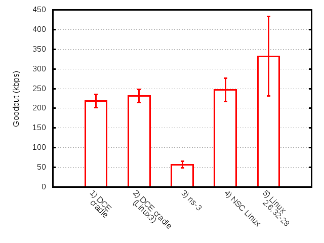
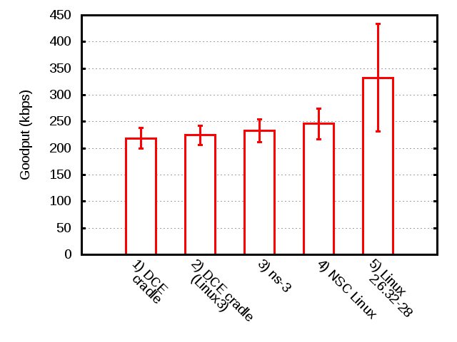

.. include:: replace.txt
DCE Cradle Use-case 1
=====================

This tutorial document describes what |dce_cradle| is, how we can use it, how we extend it.

..  (from http://reproducingnetworkresearch.wordpress.com/2012/06/01/template-for-final-project-blog-posts/)

Team:
*****
 Hajime Tazaki, Frederic Urbani, Thierry Turletti

Key Result(s):
**************
.. one-sentence, easily accessible description of each result.

TCP goodput performance in |dce_cradle| shows similar results with
real network configuration and software on Linux.

Source(s):
**********
.. papers (appropriately referenced, and with a link), websites, videos.

The paper describing this text was submitted to Workshop on ns-3 2013 (under review).

Contacts:
*********
.. names / emails.

Hajime Tazaki (tazaki at nict.go.jp)

Introduction:
*************
.. Briefly introduce the paper, its motivation, and explain the graph you hoped to replicate.

|dce_cradle| allows us to use ns-3 native application with Linux kerne
as a network stack.  The key question is: how different/similar
|dce_cradle| behaves ? This tutorial tries to answer this question
with showing TCP goodput performance.

Methods:
********
.. How was the experiment implemented and run?  What software and algorithms did you use?  This section might include graphs to validate that a project works as expected.

We need to prepare the following simulation codes to conduct the experiment.

* ns-3-dev
* ns-3-dce
* ns-3-linux
* Network Simulation Cradle (NSC)
* |dce_cradle| `patch <https://codereview.appspot.com/download/issue6856090_7001.diff>`_
* iperf
* Linux TC (packet loss and delay injection)

Results:
********
.. Describe your results.  Do they appear to be the same as the paper?  Assuming you could replicate the key results, what other results do you have?

While the experimentation with ns-3 native TCP stack shows about 83%
less bandwidth than with the real environment, NSC and |dce_cradle|
obtain more realistic performance (only 25-30% less bandwidth than
with the real environment) under the simple dumbbel topology scenario.

**(News)**
If we changed the default variables of |ns3| TCP stack as follows, the result of goodput has improved.

::

      Config::SetDefault ("ns3::TcpSocket::SegmentSize", UintegerValue (1448));
      Config::SetDefault ("ns3::TcpSocket::DelAckCount", UintegerValue (1));

.. Lessons Learned: 
.. ****************
.. What did you learn?  Explain scaling limits of your experiment, any aspects of the paper that you found to be underspecified, stuff in Linux you needed to fix, and anything that would not be obvious or apparent after reading the paper.  What were your implementation experiences - what was hard, and what just worked?  Could you use Mininet HiFi as-is, or did it require changes?  Did running EC2 present any issues?

Instructions to Replicate This Experiment:
******************************************
.. Provide sufficiently detailed instructions for anyone to repeat the results, ideally in less than 15 minutes and with a single script.  Note the location of all code, along with specific version numbers (like SHA1's for git).  A custom AMI would ideally not be needed to replicate the experiment, but if this makes replication much easier, then go ahead.  We prefer if a single Ubuntu 12.04 EC2 c1.xlarge can run everything, even if you need to update the kernel with custom .deb packages.

#. Experiment on ns-3

   #. Setup ns-3-dce

      ::

      % mkdir dce-cradle-test
      % cd dce-cradle-test
      % hg clone -r 327 http://code.nsnam.org/furbani/ns-3-dce
      % ./utils/clone_and_compile_ns3_dce.sh

      for more information, see the DCE documentation.
   #. patch |dce_cradle| extension

      ::

      % cd dce-cradle-test
      % wget https://codereview.appspot.com/download/issue6856090_7001.diff
      % cd ns-3-dce
      % patch -p1 < ../issue6856090_7001.diff
      % ./waf
      % ./waf install

   #. prepare Network Simulation Cradle

      ::

      % cd dce-cradle-test
      % wget http://research.wand.net.nz/software/nsc/nsc-0.5.3.tar.bz2
      % tar xfj nsc-0.5.3.tar.bz2
      % mv nsc-0.5.3 nsc
      % cd nsc
      % ./scons.py
      % cp lib/liblinux2.6.26.so ../build/lib/
      % cd ..
      % cd ns-3-dev
      % /waf configure --prefix=`pwd`/../build --with-nsc=../nsc
      % ./waf
      % ./waf install

   #. run a script

      .. literalinclude:: dce-cradle-test.sh
        :emphasize-lines: 20
        :linenos:
        :lines: 1-24, 40-

#. Experiment on Linux real network

   #. prepare dumbbell topology

      ::

            node1              node5
                \              /
               node3 ======== node4
                /              \
            node2              node6

   #. configure bottleneck link

      at node3, packet loss and delay are configured with tc.

      ::

            sudo tc qdisc add dev eth0 root handle 1:0 tbf limit 15Kb buffer 10Kb/8 rate 2Mbit
      	    sudo tc qdisc add dev eth0 parent 1:0 handle 10: netem delay 100ms loss 5%
	    sudo sysctl -w net.ipv4.ip_forward=1

      at node4, packet loss and delay are configured with tc as well.

      ::

            sudo tc qdisc add dev eth0 root handle 1:0 tbf limit 15Kb buffer 10Kb/8 rate 2Mbit
      	    sudo tc qdisc add dev eth0 parent 1:0 handle 10: netem delay 100ms loss 5%
            sudo sysctl -w net.ipv4.ip_forward=1

   #. run a script at node1

      .. literalinclude:: iperf-dumbbell.sh
        :linenos:
        :lines: 1-5,9-16,26-37,43-

#. Plot the results of above experiment

   #. run a script

      You can gather the text outputs from the above experiments and plot the figure with gnuplot.
   

      .. literalinclude:: dce-cradle-gnuplot.sh
            :linenos:
            :lines: 1-38

.. Not use at this moment
.. sim1:~% sudo ip add add  10.0.0.1/24 dev virbr2
.. sim2:~% sudo ip add add  10.0.1.1/24 dev ib0
.. sim3:~% 
.. sudo ip add add  10.0.0.2/24 dev ib0
.. sudo ip add add  10.0.1.2/24 dev ib0
.. sudo ip add add  10.1.0.1/24 dev eth0
.. sim4:~% sudo ip add add  10.2.0.1/24 dev ib0 
.. sudo ip add add  10.1.0.2/24 dev eth0
.. sim4:~% sudo ip add add  10.2.1.1/24 dev ib0
.. sim5:~% sudo ip add add  10.2.0.2/24 dev ib0
.. sim6:~% sudo ip add add  10.2.1.2/24 dev ib0

.. sim1:~% sudo ip route add 10.0.0.0/8 via 10.0.0.2
.. sim2:~% sudo ip route add 10.0.0.0/8 via 10.0.1.2
.. sim3:~% 
..  sudo ip route add 10.2.0.0/16 via 10.1.0.2
.. sim4:~% 
..  sudo ip route add 10.0.0.0/16 via 10.1.0.1
.. sim5:~% sudo ip route add 10.0.0.0/16 via 10.2.0.1
.. sim6:~% sudo ip route add 10.0.0.0/16 via 10.2.1.1
.. u1210-64-1%: sudo ip add add  10.0.0.11/24 dev eth0
.. u1210-64-1%: sudo ip route add 10.0.0.0/8 via 10.0.0.2

