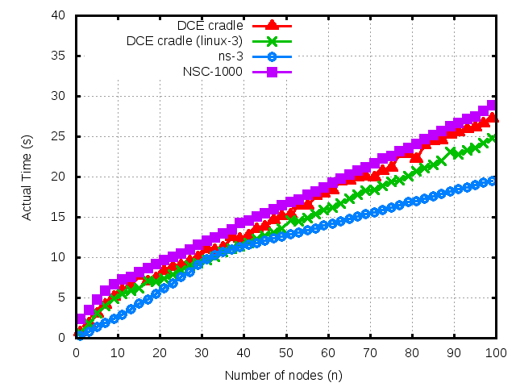

.. include:: replace.txt
DCE Cradle Use-case 2
=====================

This tutorial  document describes what |dce_cradle| is, how we can use it, how we extend it.

.. (from http://reproducingnetworkresearch.wordpress.com/2012/06/01/template-for-final-project-blog-posts/)

Team:
*****
 Hajime Tazaki, Frederic Urbani, Thierry Turletti

Key Result(s):
**************
.. one-sentence, easily accessible description of each result.

|dce_cradle| does not add much overhead in terms of scaling the number
of nodes in simulations compared to Network Simulation Cradle and ns-3
native stack.

Source(s):
**********
.. papers (appropriately referenced, and with a link), websites, videos.

The paper describing this text was submitted to Workshop on ns-3 2013 (under review).

Contacts:
*********
.. names / emails.

Hajime Tazaki (tazaki at nict.go.jp)

Introduction:
*************
.. Briefly introduce the paper, its motivation, and explain the graph you hoped to replicate.

|dce_cradle| allows us to use ns-3 native application with Linux kerne
as a network stack.  The key question is: how different/similar
|dce_cradle| behaves ? This tutorial tries to answer this question
with showing the performance of actual simulation time.

Methods:
********
.. How was the experiment implemented and run?  What software and algorithms did you use?  This section might include graphs to validate that a project works as expected.

We need to prepare the following simulation codes to conduct the experiment.

* ns-3-dev
* ns-3-dce
* ns-3-linux
* Network Simulation Cradle (NSC)
* |dce_cradle| `patch <https://codereview.appspot.com/download/issue6856090_7001.diff>`_

Results:
********
.. Describe your results.  Do they appear to be the same as the paper?  Assuming you could replicate the key results, what other results do you have?

.. Lessons Learned: 
.. ****************
.. What did you learn?  Explain scaling limits of your experiment, any aspects of the paper that you found to be underspecified, stuff in Linux you needed to fix, and anything that would not be obvious or apparent after reading the paper.  What were your implementation experiences - what was hard, and what just worked?  Could you use Mininet HiFi as-is, or did it require changes?  Did running EC2 present any issues?

Instructions to Replicate This Experiment:
******************************************
.. Provide sufficiently detailed instructions for anyone to repeat the results, ideally in less than 15 minutes and with a single script.  Note the location of all code, along with specific version numbers (like SHA1's for git).  A custom AMI would ideally not be needed to replicate the experiment, but if this makes replication much easier, then go ahead.  We prefer if a single Ubuntu 12.04 EC2 c1.xlarge can run everything, even if you need to update the kernel with custom .deb packages.

#. Experiment on ns-3

   #. Setup ns-3-dce

      ::

      % mkdir dce-cradle-test
      % cd dce-cradle-test
      % hg clone -r 327 http://code.nsnam.org/furbani/ns-3-dce
      % ./utils/clone_and_compile_ns3_dce.sh

      for more information, see the DCE documentation.
   #. patch |dce_cradle| extension

      ::

      % cd dce-cradle-test
      % wget https://codereview.appspot.com/download/issue6856090_7001.diff
      % cd ns-3-dce
      % patch -p1 < ../issue6856090_7001.diff
      % ./waf
      % ./waf install

   #. prepare Network Simulation Cradle

      ::

      % cd dce-cradle-test
      % wget http://research.wand.net.nz/software/nsc/nsc-0.5.3.tar.bz2
      % tar xfj nsc-0.5.3.tar.bz2
      % mv nsc-0.5.3 nsc
      % cd nsc
      % ./scons.py
      % cp lib/liblinux2.6.26.so ../build/lib/
      % cd ..
      % cd ns-3-dev
      % /waf configure --prefix=`pwd`/../build --with-nsc=../nsc
      % ./waf
      % ./waf install

   #. run a script

      .. literalinclude:: dce-cradle-test.sh
	 :emphasize-lines: 20
         :linenos:
	 :lines: 1-12,25-31,38-

#. Plot the results of above experiment

   #. run a script

      You can gather the text outputs from the above experiments and plot the figure with gnuplot.
   

      .. literalinclude:: dce-cradle-gnuplot.sh
         :linenos:
	 :lines: 1-10,72-106
