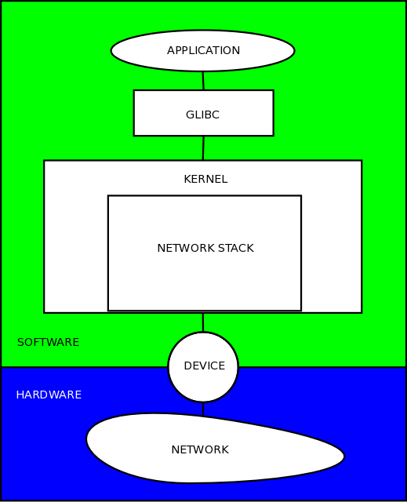
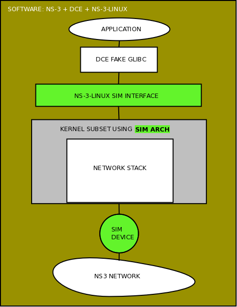

.. include:: replace.txt
Kernel Developer Information
****************************

This technical documentation is intended for developers who want to build a Linux kernel in order to use with DCE.
A first part will describe the architecture and the second will show how we went from a net-next kernel 2.6 has a Linux kernel-stable 3.4.5.

Prerequisite
============

You must be familiar with |ns3|, DCE and Linux Kernel Developpement.

Download
========

The source code can be found in the following repository: http://code.nsnam.org/furbani/ns-3-linux.
You must use mercurial to download the source code.

Goal
====

The goal of this work is to use the real implementation of the Linux Network Stack within the Simulation environment furnished by |ns3|. 

Solution
========

The solution chosen was to use the Linux kernel source, compile the Net part and make a dynamic library and interface the result with DCE.

The following schema shows the different parts between a software user space application and the hardware network.

The following schema show the same application running under DCE and |ns3| and using a real kernel network stack:

The green parts are implemented in ns-3-linux source files, the grays parts comes from the Linux kernel sources and are not modified at all or with only few changes.
Application should not be modified at all.

Concepts
========

If you need a more theoretical documentation you can read the chapter 4.5 of this Ph.D. thesis `Experimentation Tools for Networking Research <http://cutebugs.net/files/thesis.pdf>`_.

List of files and usage
=======================

After doing the cloning of the source, 

::

  $ hg clone http://code.nsnam.org/furbani/ns-3-linux
  destination directory: ns-3-linux
  requesting all changes
  adding changesets
  adding manifests
  adding file changes
  added 62 changesets with 274 changes to 130 files
  updating to branch default
  125 files updated, 0 files merged, 0 files removed, 0 files unresolved
  
Below are the files delivered under the directory *ns-3-linux*:

::

  $ ls ns-3-linux/
  generate-autoconf.py  generate-linker-script.py  kernel-dsmip6.patch  kernel.patch  Makefile  Makefile.print  processor.mk  README  sim
  
The main file is the **Makefile** its role is to recover the kernel source, compile the NET part of the kernel and all that is necessary for the operation, the end result is a shared library that can be loaded by DCE.

::

  $ ls ns-3-linux/sim
  cred.c     glue.c     Kconfig    pid.c    random.c    seq.c         sim-socket.c  softirq.c  tasklet.c          timer.c
  defconfig  hrtimer.c  Makefile   print.c  sched.c     sim.c         slab.c        sysctl.c   tasklet-hrtimer.c  workqueue.c
  fs.c       include    modules.c  proc.c   security.c  sim-device.c  socket.c      sysfs.c    time.c

  $ ls ns-3-linux/sim/include
  asm  generated  sim-assert.h  sim.h  sim-init.h  sim-printf.h  sim-types.h

These directories contains the architecture specific code and the code doing the interface between the kernel and DCE and |ns3|.  
Ideally we should not change a line of code outside the kernel arch portion, but in practice we make small changes : see the patchs files.

Recall: the code of Linux source is mainly C so it is very easy to port to new architecture, the architecture specific code is contained in a specific directory under arch/XXX directory where XXX name recall the processor used. In our case we have chosen to create a special architecture for our environment NS3 + DCE, we called **sim**.

Interfaces between Kernel and DCE
=================================
In order to install a kernel on a Node DCE do the following steps:

1. Load the shared library containing the kernel compilation result,
2. Call the init function called **sim_init**, this method is located in the just loaded library,
3. This **sim_init** method is called with a parameter which is a struct containing functions pointers to DCE methods able to be callable from the kernel part,
4. in return the **sim_init** fill a struct containing function pointers in kernel part which will be used by DCE to interract with the kernel part.
5. before finish **sim_init** must initialize the kernel to put it in a running state ready to be usable.
 
Kernel -> DCE
-------------

Methods (there is also one variable) of DCE called by the kernels are the following:

* LinuxSocketFdFactory::Vprintf
* LinuxSocketFdFactory::Malloc
* LinuxSocketFdFactory::Free
* LinuxSocketFdFactory::Memcpy
* LinuxSocketFdFactory::Memset
* LinuxSocketFdFactory::Random
* LinuxSocketFdFactory::EventScheduleNs
* LinuxSocketFdFactory::EventCancel
* CurrentNs
* LinuxSocketFdFactory::TaskStart
* LinuxSocketFdFactory::TaskWait
* LinuxSocketFdFactory::TaskCurrent
* LinuxSocketFdFactory::TaskWakeup
* LinuxSocketFdFactory::TaskYield
* LinuxSocketFdFactory::DevXmit
* LinuxSocketFdFactory::SignalRaised
* LinuxSocketFdFactory::PollEvent

there are located in the source file **linux-socket-fd-factory.cc** of DCE.

DCE -> Kernel
-------------

Methods of Kernel (sim part) called by DCE are the following:

* task_create
* task_destroy
* task_get_private
* sock_socket
* sock_close
* sock_recvmsg
* sock_sendmsg
* sock_getsockname
* sock_getpeername
* sock_bind
* sock_connect
* sock_listen
* sock_shutdown
* sock_accept
* sock_ioctl
* sock_setsockopt
* sock_getsockopt
* sock_poll
* sock_pollfreewait
* dev_create
* dev_destroy
* dev_get_private
* dev_set_address
* dev_set_mtu
* dev_create_packet
* dev_rx
* sys_iterate_files
* sys_file_read
* sys_file_write

the corresponding sources are located in the **sim** directory.

Build net-next 2.6 kernel
=========================

All build operations are done using the make command with the **Makefile** file under the directory **ns-3-linux**.

Make Setup
----------

First you should call **make setup** in order to download the source of the kernel:

::

  $ make setup
  git clone git://git.kernel.org/pub/scm/linux/kernel/git/davem/net-next.git net-next-2.6; \
            cd net-next-2.6 && git reset --hard fed66381d65a35198639f564365e61a7f256bf79
  Cloning into net-next-2.6...
  remote: Counting objects: 2441000, done.
  remote: Compressing objects: 100% (377669/377669), done.
  Receiving objects: 100% (2441000/2441000), 493.28 MiB | 28.45 MiB/s, done.
  remote: Total 2441000 (delta 2043525), reused 2436782 (delta 2039307)
  Resolving deltas: 100% (2043525/2043525), done.
  Checking out files: 100% (33319/33319), done.

This sources correspond to a specific version well tested with DCE the net-next 2.6 and git tag = fed66381d65a35198639f564365e61a7f256bf79.

Now the directory **net-next-2.6** contains the kernel sources. 

Make Menuconfig
---------------

Use **make menuconfig** to configure your kernel, note that modules are not supported by our architecture so options chosen as modules will not be included in the result kernel.

Build
-----

Finally **make** will compile all the needed sources and produce a file named **libnet-next-2.6.so**: this is the library contains our net-next kernel suitable for DCE usage.

Usage
-----

To use this kernel you should:

1. configure DCE in order to compile using the includes under **sim** directories to have the good interfaces between DCE and the kernel.
For this you should give to the waf configure the path to the **ns-3-linux** directory i.e.:

::

  $ ./waf configure ----enable-kernel-stack=/ABSOLUTE-PATH-TO/ns-3-linux

2. In your |ns3| scenario you should indicate the good kernel file: (the file should be located in a directory presents in the DCE_PATH env. variable)

::

   dceManager.SetNetworkStack("ns3::LinuxSocketFdFactory", "Library", 
                              StringValue ("libnet-next-2.6.so"));

Test
----

Use DCE unit test:

::
  
  $ ./waf --run "test-runner --verbose"
  PASS process-manager 9.470ms
  PASS Check that process "test-empty" completes correctly. 0.920ms
  PASS Check that process "test-sleep" completes correctly. 0.080ms
  PASS Check that process "test-pthread" completes correctly. 0.110ms
  PASS Check that process "test-mutex" completes correctly. 0.200ms
  PASS Check that process "test-once" completes correctly. 0.070ms
  PASS Check that process "test-pthread-key" completes correctly. 0.070ms
  PASS Check that process "test-sem" completes correctly. 0.080ms
  PASS Check that process "test-malloc" completes correctly. 0.060ms
  PASS Check that process "test-malloc-2" completes correctly. 0.060ms
  PASS Check that process "test-fd-simple" completes correctly. 0.070ms
  PASS Check that process "test-strerror" completes correctly. 0.070ms
  PASS Check that process "test-stdio" completes correctly. 0.240ms
  PASS Check that process "test-string" completes correctly. 0.060ms
  PASS Check that process "test-netdb" completes correctly. 3.940ms
  PASS Check that process "test-env" completes correctly. 0.050ms
  PASS Check that process "test-cond" completes correctly. 0.160ms
  PASS Check that process "test-timer-fd" completes correctly. 0.060ms
  PASS Check that process "test-stdlib" completes correctly. 0.060ms
  PASS Check that process "test-fork" completes correctly. 0.120ms
  PASS Check that process "test-select" completes correctly. 0.320ms
  PASS Check that process "test-nanosleep" completes correctly. 0.070ms
  PASS Check that process "test-random" completes correctly. 0.090ms
  PASS Check that process "test-local-socket" completes correctly. 0.820ms
  PASS Check that process "test-poll" completes correctly. 0.320ms
  PASS Check that process "test-exec" completes correctly. 0.380ms
  PASS Check that process "test-iperf" completes correctly. 0.070ms
  PASS Check that process "test-name" completes correctly. 0.080ms
  PASS Check that process "test-pipe" completes correctly. 0.160ms
  PASS Check that process "test-dirent" completes correctly. 0.070ms
  PASS Check that process "test-socket" completes correctly. 0.270ms
  PASS Check that process "test-bug-multi-select" completes correctly. 0.260ms
  PASS Check that process "test-tsearch" completes correctly. 0.080ms

 
All is OK.

net-next 2.6 to linux-stable 3.4.5
==================================

Now we will try to use a more recent linux kernel.
We start with a fresh clone of the ns-3-linux sources.

Makefile
--------

First we need to modify the makefile in order to change the kernel downloaded.
For that we need to modify the value of 2 variables:

1. KERNEL_DIR=linux-stable
2. KERNEL_VERSION=763c71b1319c56272e42cf6ada6994131f0193a7
3. KERNEL_DOWNLOAD=git://git.kernel.org/pub/scm/linux/kernel/git/stable/linux-stable.git

Also we need to remove the patch target named **.target.ts** because the patch will not pass for this newer version of kernel. 

First Build
-----------

Now we can try to build:

::

  $ make defconfig
  $ make menuconfig
  $ make
  mkdir -p sim
  cc -O0 -g3 -D__KERNEL__ -Wall -Wstrict-prototypes -Wno-trigraphs -fno-inline \
             -iwithprefix ./linux-stable/include -DKBUILD_BASENAME=\"clnt\"    \
             -fno-strict-aliasing -fno-common -fno-delete-null-pointer-checks  \
             -fno-stack-protector -DKBUILD_MODNAME=\"nsc\" -DMODVERSIONS       \
             -DEXPORT_SYMTAB -include autoconf.h -U__FreeBSD__ -D__linux__=1   \
             -Dlinux=1 -D__linux=1 -I./sim/include -I./linux-stable/include    \
             -fpic -DPIC -D_DEBUG \
             -I/home/furbani/dev/dce/dev/etude_kernel/V3/ns-3-linux            \
             -DCONFIG_64BIT -c sim/fs.c -o sim/fs.o
  In file included from ./linux-stable/include/asm-generic/bitops.h:12:0,
                   from ./sim/include/asm/bitops.h:4,
                   from ./linux-stable/include/linux/bitops.h:22,
                   from ./linux-stable/include/linux/thread_info.h:52,
                   from ./linux-stable/include/linux/preempt.h:9,
                   from ./linux-stable/include/linux/spinlock.h:50,
                   from ./linux-stable/include/linux/wait.h:24,
                   from ./linux-stable/include/linux/fs.h:385,
                   from sim/fs.c:1:
  ./linux-stable/include/linux/irqflags.h:66:0: warning: "raw_local_irq_restore" redefined
  ./sim/include/asm/irqflags.h:8:0: note: this is the location of the previous definition
  In file included from ./linux-stable/include/linux/wait.h:24:0,
                   from ./linux-stable/include/linux/fs.h:385,
                   from sim/fs.c:1:
  ./linux-stable/include/linux/spinlock.h:58:25: fatal error: asm/barrier.h: No such file or directory
  compilation terminated.
  make: *** [sim/fs.o] Error 1

Ok now we will try to fix the compilation errors trying not to change too the kernel source. In the following we will list the main difficulties encountered.

First Error
-----------

Recall: the linux source directory **include/asm-generic** contains a C reference implementation of some code that should be written in assembly langage for the target architecture. So this code is intented to help the developper to port to new architectures. 
So our sim implementation use many of these **asm-generic** include files.
The first warning show that our code redefine a method defined elsewhere in kernel sources, so the fix is to remove our definition of this function in opur file named **sim/include/asm/irqflags.h**.

Second Error
------------

The file **asm/barrier.h** is missing, we just create under sim/include/asm directory and the implementation is to include the generic one ie: **include/asm-generic/barrier.h**.

Change in sim method
--------------------

Another problem arise the function named **kern_mount_data** defined in **sim/fs.c** do not compile any more. 
So we need to investigate about this function:

 1. Where this function is located in the real code: in **linux/fs/namespace.c**
 2. Why it is reimplemented in **sim/fs.c**: if you look at our Makefile why try to not compile all the kernel we focus on the net part only, you can see this line in the Makefile :

::
   
  dirs=kernel/ mm/ crypto/ lib/ drivers/base/ drivers/net/ net/

in fact we include only this directories.
So at this time we can comment the failing line and insert a **sim_assert (false);** in order to continue to fix the compilation errors, and then when we will do the first run test we will see if this method is called and if yes we will need to do a better fix.
Remark: **sim_assert (false);** is a macro used to crash the execution, we often place it in functions that we need to emulate because required by the linker but that should never be called.

Change in our makefile
----------------------

After we have the following problem while compiling **sim/glue.c** the macro **IS_ENABLED** is not defined. After some search we found that we need to include **linux/kconfig.h** in many files. So we modify our makefile to fix like this:

::

    -fno-stack-protector \
    -DKBUILD_MODNAME=\"nsc\" -DMODVERSIONS -DEXPORT_SYMTAB \
  - -include autoconf.h \
  + -include $(SRCDIR)$(KERNEL_DIR)/include/linux/kconfig.h \
    -U__FreeBSD__ -D__linux__=1 -Dlinux=1 -D__linux=1 \
    -I$(SRCDIR)sim/include -I$(SRCDIR)$(KERNEL_DIR)/include \
    $(AUTOCONF): generate-autoconf.py $(KERNEL_DIR)/.config timeconst.h
    ./generate-autoconf.py $(KERNEL_DIR)/.config > $@
  + cp autoconf.h sim/include/generated/autoconf.h
  +	
    timeconst.h: $(KERNEL_DIR)/.config
 	perl $(SRCDIR)$(KERNEL_DIR)/kernel/timeconst.pl $(CONFIG_HZ) > $@

Change in kernel source
-----------------------

Our **sim/slab.c** do not compile, in this case we want to use our implementation of memory allocation and to do this it is easier to modify slightly an include file in the kernel sources **include/linux/slab.h** :

:: 

  --- a/include/linux/slab.h
  +++ b/include/linux/slab.h
  @@ -185,6 +185,8 @@ size_t ksize(const void *);
   #include <linux/slub_def.h>
   #elif defined(CONFIG_SLOB)
   #include <linux/slob_def.h>
  +#elif defined(CONFIG_SIM)
  +#include <asm/slab.h>
   #else
   #include <linux/slab_def.h>
   #endif

As we have already written we do not recommend to change the kernel sources to facilitate future upgrades.

First Launch
------------

After a few corrections we finally get a library containing the kernel named **liblinux-stable.so**. At this moment we need to try it using DCE. For the beginning we will try with test-runner executable.

::

  ./test.py
  assert failed. cond="handle != 0", msg="Could not open elf-cache/0/libnet-next-2.6.so elf-cache/0/liblinux-stable.so: undefined symbol: noop_llseek", file=../model/cooja-loader-factory.cc, line=225
  terminate called without an active exception
  Aborted (core dumped)

We can see that a symbol is not defined : **noop_llseek**. We find this symbol defined in the kernel source named **fs/read_write.cc**. We need to choose a way to add this symbol in our kernel library, we can:

 - rewrite it in a source under our sim directory,
 - or add it in our makefile. 

In this case we choose the second solution so we need to modify our makefile, first we see that the directory **fs** is not present in the **dirs** entry, so we need to add it in the write order (order is the same as found in the kernel Makefile defined by the variable 
named **vmlinux-main**); we also need to indicate that we want only the object **read_write.o**:

::

  @@ -51,7 +52,7 @@
  AUTOCONF=autoconf.h
  # note: the directory order below matters to ensure that we match the kernel order
  -dirs=kernel/ mm/ crypto/ lib/ drivers/base/ drivers/net/ net/
  +dirs=kernel/ mm/ fs/ crypto/ lib/ drivers/base/ drivers/net/ net/
   empty:=
   space:= $(empty) $(empty)
   colon:= :
  @@ -67,11 +68,12 @@
   ctype.o string.o kasprintf.o rbtree.o sha1.o textsearch.o vsprintf.o \
   rwsem-spinlock.o scatterlist.o ratelimit.o hexdump.o dec_and_lock.o \
   div64.o
  +fs/_to_keep=read_write.o

Fake Function
-------------

We continue to try our kernel library, now another symbol is missing **generic_file_aio_read**, this symbol is defined in the source **mm/filemap.cc**, it is referenced at least by **read_write.c**.
In this case we decided to create a fake function because the source **mm/filemap.cc** is voluminous and we do not want to take all the kernel sources. So we create a new source under **sim** directory named **sim/filemap.c** the body of the function is  **sim_assert (false);** so if this function called sometimes we will be warned and we will write a more accurate version.

Assert
------

Later we meet again the function **kern_mount_data**, thanks to the presence of the sim_assert:

.. code-block:: console
  
  0x00007ffff5c8c572 in kern_mount_data (fs=<optimized out>, data=<optimized out>) at sim/fs.c:52
  52	  sim_assert (false);
  (gdb) bt
  #0  0x00007ffff5c8c572 in kern_mount_data (fs=<optimized out>, data=<optimized out>) at sim/fs.c:52
  #1  0x00007ffff5d85923 in sock_init () at linux-stable/net/socket.c:2548
  #2  0x00007ffff5c8d3aa in sim_init (exported=<optimized out>, imported=<optimized out>, kernel=<optimized out>) at sim/sim.c:169
  #3  0x00007ffff7d9151b in ns3::LinuxSocketFdFactory::InitializeStack (this=0x65bde0) at ../model/linux-socket-fd-factory.cc:535
  #4  0x00007ffff7d95ce4 in ns3::EventMemberImpl0::Notify (this=0x6597a0) at /home/furbani/dev/dce/dev/build/include/ns3-dev/ns3/make-event.h:94
  #5  0x00007ffff76b10a8 in ns3::EventImpl::Invoke (this=0x6597a0) at ../src/core/model/event-impl.cc:39
  #6  0x00007ffff7d8ff7c in ns3::LinuxSocketFdFactory::ScheduleTaskTrampoline (context=0x6597a0) at ../model/linux-socket-fd-factory.cc:373
  #7  0x00007ffff7d3b7d4 in ns3::TaskManager::Trampoline (context=0x65d170) at ../model/task-manager.cc:250
  #8  0x00007ffff7d37acd in ns3::PthreadFiberManager::Run (arg=0x65d5d0) at ../model/pthread-fiber-manager.cc:398
  #9  0x00000034be206ccb in start_thread () from /lib64/libpthread.so.0
  #10 0x00000034bd6e0c2d in clone () from /lib64/libc.so.6
  (gdb) 
  
So this function is called by the initialisation, we must provide an implementation for it:

.. code-block:: c
  :caption: Implementation taken from vfs_kern_mount from linux/namespace.c

  struct vfsmount *kern_mount_data(struct file_system_type *type, void *data)
  {
  	static struct mount local_mnt;
  	struct mount *mnt = &local_mnt;
  	struct dentry *root = 0;
  
  	memset (mnt,0,sizeof (struct mount));
  	if (!type)
  		return ERR_PTR(-ENODEV);
  	int flags = MS_KERNMOUNT;
  	char *name = type->name;
  	if (flags & MS_KERNMOUNT)
  		mnt->mnt.mnt_flags = MNT_INTERNAL;
  
  	root = type->mount(type, flags, name, data);
  	if (IS_ERR(root)) {
  		return ERR_CAST(root);
  	}
  
  	mnt->mnt.mnt_root = root;
  	mnt->mnt.mnt_sb = root->d_sb;
  	mnt->mnt_mountpoint = mnt->mnt.mnt_root;
  	mnt->mnt_parent = mnt;
  //	br_write_lock(vfsmount_lock);   DCE is monothreaded , so we do not care of lock here
  	list_add_tail(&mnt->mnt_instance, &root->d_sb->s_mounts);
  //	br_write_unlock(vfsmount_lock);  DCE is monothreaded , so we do not care of lock here
  	
  	return &mnt->mnt;
  }

Here we do not want to integrate all the code namespace.c, so we copy and paste the function named **kern_mount_data**. This solution has the advantage of minimizing code size, the disadvantage is that it can introduce problems if the next version of the kernel need changes in this function.

Conclusion
==========

We will not describe the rest of the port here. But after some iteration we end up with a version that works correctly. Sometimes we should not hesitate to use **gdb** to trace the actual execution and correct accordingly code.
The rules that we can gain from this experience's are as follows:

1. Be patient,
2. Try to not modify the kernel sources,
3. Be pragmatic,
4. Try to not import all the kernel code into our library,
5. Do not hesitate to go back and test other alternatives.

.. TODO
.. ****

.. What about two version in same ns-3-linux repository ?

