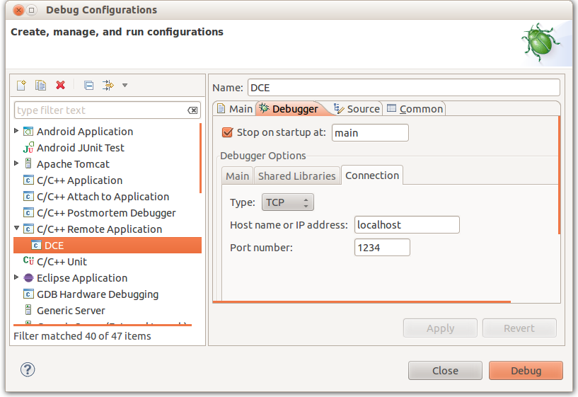

.. include:: replace.txt
Debugging your protocols with DCE
=================================

Gdb
---
It is possible to use gdb to debug a script DCE/|ns3|. As explained somewhere in the execution of a script is monoprocess, then you can put breakpoints in both sources of DCE and those of binaries hosted by DCE.

Install
^^^^^^^

Although it is not strictly necessary, it is recommended that you recompile a CVS Gdb 
for use with ns-3-dce. First, download:

  cvs -d :pserver:anoncvs@sourceware.org:/cvs/src login
  {enter "anoncvs" as the password}
  cvs -d :pserver:anoncvs@sourceware.org:/cvs/src co gdb

Note that you might consider looking at http://sourceware.org/gdb/current/ to obtain
more efficient (cpu/bandwidth-wise) download instructions.

Anyway, now, you can build:

.. highlight:: sh
::

  cd gdb
  ./configure
  make

And, then, invoke the version of gdb located in gdb/gdb instead of your system-installed gdb
whenever you need to debug a DCE-based program.

Using
^^^^^

If you use gdb (a CVS or stable version), do not forget to execute the following command prior
to running any DCE-based program:

::

  (gdb) handle SIGUSR1 nostop
  Signal        StopPrintPass to programDescription
  SIGUSR1       NoYesYesUser defined signal 1
  (gdb)

An alternate way to do this and avoid having to repeat this command ad-nauseam
involves creating a .gdbinit file in your ns-3-dce directory and putting this
inside:

::

  handle SIGUSR1 nostop

or it can be put on the command line using the "-ex" flag:

:: 

  ./waf --run SCRIPT_NAME_HERE --command-template="gdb -ex 'handle SIGUSR1 nostop noprint' --args %s <args>"

Setup Eclipse Remote Debugging Environment
^^^^^^^^^^^^^^^^^^^^^^^^^^^^^^^^^^^^^^^^^^

To remotely debug a DCE script you can use gdbserver as in the following example,
changing the host name and port (localhost:1234):

::

  ./waf --run dce-httpd --command-template="gdbserver localhost:1234 %s <args>"

Then you can point a gdb client to your server.
For example, in the following figure is reported an Eclipse debug configuration:

Once you start the debug session, you can use the usual Eclipse/gdb commands.

Helpful debugging hints
^^^^^^^^^^^^^^^^^^^^^^^

There are a couple of functions which are useful to put breakpoints into:

 * ns3::DceManager::StartProcessDebugHook

Put a breakpoint in a specific node in a simulation
^^^^^^^^^^^^^^^^^^^^^^^^^^^^^^^^^^^^^^^^^^^^^^^^^^^
If you got a trouble in your protocol during interactions between distributed nodes, you want to investigate a specific state of the protocol in a specific node. In a usual system, this is a typical case of using *distributed debugger* (e.g., ddt, or *mpirun xterm -e gdb --args xxx*), but it is annoying task in general due to the difficulty of controlling distributed nodes and processes.

DCE gives an easy interface to debug distributed applications/protocols by the single-process model of its architecture.

The following is an example of debugging Mobile IPv6 stack (of Linux) in a specific node (i.e., home agent). A special function *dce_debug_nodeid()* is useful if you put a break condition in a gdb session.

.. highlight:: none
::

  (gdb) b mip6_mh_filter if dce_debug_nodeid()==0
  Breakpoint 1 at 0x7ffff287c569: file net/ipv6/mip6.c, line 88.
   <continue>
  (gdb) bt 4
  #0  mip6_mh_filter (sk=0x7ffff7f69e10, skb=0x7ffff7cde8b0)
      at net/ipv6/mip6.c:109
  #1  0x00007ffff2831418 in ipv6_raw_deliver (skb=0x7ffff7cde8b0, 
      nexthdr=135)
      at net/ipv6/raw.c:199
  #2  0x00007ffff2831697 in raw6_local_deliver (skb=0x7ffff7cde8b0, 
      nexthdr=135)
      at net/ipv6/raw.c:232
  #3  0x00007ffff27e6068 in ip6_input_finish (skb=0x7ffff7cde8b0)
      at net/ipv6/ip6_input.c:197
  (More stack frames follow...)

Valgrind
--------
(FIXME: simple session using valgrind)
