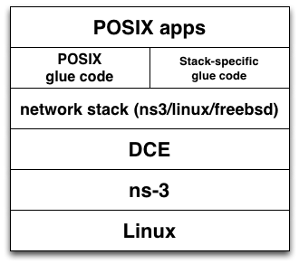

.. include:: replace.txt

FreeBSD kernel support with DCE
===============================

Overview
--------
This module provides an additional network stack support for DCE with FreeBSD kernel.

.. u    POSIX   POSIX  POSIX     ns-3   
.. k    ns-3    Linux  FreeBSD   Linux

* This is a POSIX userspace application support over FreeBSD kernel over DCE, over ns-3 over Linux.
* This is **NOT** the DCE running on FreeBSD operating system (right now DCE only run on Linux).

Usage
-----

::

  bake.py configure -e dce-freebsd-dev
  bake.py download
  bake.py build

Once you finished to build dce-freebsd module, you can write a
simulation script that uses FreeBSD kernel as a network stack.  All
you need is to specify the library name with an attribute **Library**
to **ns3::FreeBSDSocketFdFactory**, then install
**FreeBSDStackHelper** to the nodes.

::

  DceManagerHelper processManager;
  processManager.SetNetworkStack ("ns3::FreeBSDSocketFdFactory",
                             "Library", StringValue ("libfreebsd.so"));
  processManager.Install (nodes);
  FreeBSDStackHelper stack;
  stack.Install (nodes);

How to use your kernel extension with DCE ?
-------------------------------------------

No configuration support (like *make menuconfig* in Linux) right
now. You need to add files into sys/sim/Makefile.

The following represents an example to add Multipath-TCP feature of
FreeBSD by adding **mptcp_subr.o** to the
freebsd-sim/sys/sim/Makefile. If you want to add your code into the
kernel build, you may add object file names that is from your own
codes.

::

  diff --git a/sys/sim/Makefile b/sys/sim/Makefile
  index 8115e3d..1b2feab 100644
  --- a/sys/sim/Makefile
  +++ b/sys/sim/Makefile
  @@ -100,7 +100,7 @@ ip_divert.o tcp_hostcache.o ip_ecn.o tcp_input.o ip_encap.o 
  \
   tcp_lro.o ip_fastfwd.o tcp_offload.o ip_gre.o tcp_output.o \
   ip_icmp.o tcp_reass.o ip_id.o tcp_sack.o ip_input.o tcp_subr.o \
   tcp_syncache.o ip_mroute.o tcp_timer.o ip_options.o tcp_timewait.o \
  -ip_output.o tcp_usrreq.o raw_ip.o udp_usrreq.o if_llatbl.o
  +ip_output.o tcp_usrreq.o raw_ip.o udp_usrreq.o if_llatbl.o mptcp_subr.o

Limitations
-----------
While this release gives a proof of concept to use FreeBSD kernel with
DCE, there are tons of limitations (listed below) that have to be
improved in near future.

* No sysctl
* No IPv6 address configuration
* No ifconfig
 * No delete IP addresses support
* No route command
* No quagga, new FreeBSD-version glue code needed
* No extensive test
* No DCE Cradle
* No Poll implementation
* No getifaddr/routing socket implementations
* Socket options missing (incosistent defined value: SOL_SOCKET(Linux/FreeBSD)=20/0xffff)

TODO
----
* refactoring with LinuxStackHelper/FreeBSDStackHelper
* refactoring with wscript (--enable-kernel-stack uses both FreeBSD/Linux for now)

