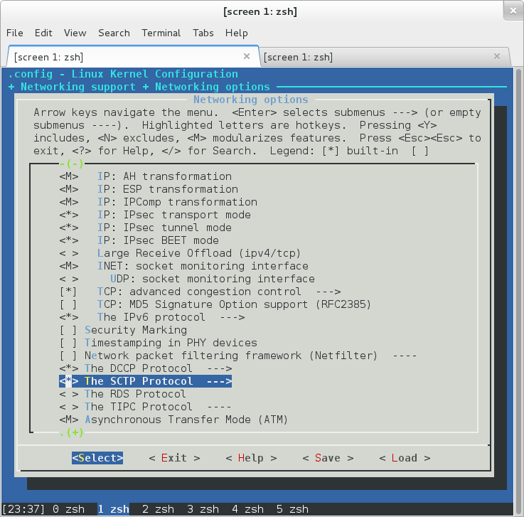

.. include:: replace.txt

Using your in-kernel protocol implementation
============================================

There are a number of protocols implemented in kernel space, like many transport protocols (e.g., TCP, UDP, SCTP), Layer-3 forwarding plane (IPv4, v6 with related protocols ARP, Neighbor Discovery, etc). 
DCE can simulate these protocols with |ns3|.

This document describes an example when we supported new protocol, Stream Control Transmission Protcool (SCTP), with DCE.
Although other protocols may not adapt this patterns as-is, you will see what's needed to implement for your purpose.

.. contents::
   :local:

1. Extend *net-next-sim* kernel (make menuconfig in Linux)
-------------------------------------------------------
In Linux kernel, there is a configuration system in Linux kernel to enable/disable features. This is typically done by *make menuconfig* command, and it writes a file (.config) at the kernel source directory. Build system (e.g., make bzImage) refers the file which source files are compiled.

In our DCE Linux kernel module (i.e. **net-next-sim** available at github.com), we have *arch/sim/defconfig* file to store the default configuration of kernel features. You may need to add proper configuration parameters (e.g., CONFIG_IP_SCTP) to build the protocol by default.

For the Linux SCTP implementation, we need at least the following configuration parameters.

 - CONFIG_IP_SCTP=y
 - CONFIG_SCTP_DEFAULT_COOKIE_HMAC_NONE=y
 - CONFIG_CRYPTO_CRC32C=y
 - CONFIG_CRC32=y

These should be added to the file (*arch/sim/defconfig*).

**Note**

These configuration options **SHOULD** be minimized at the beginning since adding new option may require new functions which DCE doesn't support at the time and need to implement glue code.

2. Build *liblinux.so*
-------------------

To build the liblinux.so, DCE version of Linux kernel,

::

    make defconfig
    make library ARCH=sim

You can use *make menuconfig* command (below) instead of editing the defconfig file.
If everything is fine, you will see **liblinux.so** linked to **libsim-linuxv.y.z.so** file at the root directory of Linux kernel.

::

    make menuconfig ARCH=sim

3. Write user space application to use this protocol
-------------------------------------------------
Then, we need to write userspace applications using new feature of kernel protocol. In case of SCTP, we wrote `sctp-client.cc <http://code.nsnam.org/ns-3-dce/file/tip/example/sctp-client.cc>`_ and `sctp-server.cc <http://code.nsnam.org/ns-3-dce/file/tip/example/sctp-server.cc>`_.

**Optional**
You may optinally need external libraries to build/run the applications. In this case, the applications need *lksctp-tools*, so that applications fully benefit the features of SCTP, rather than only using standard POSIX socket API. 

Moreover, adding system dependency to bake configuration file (i.e., bakeconf.xml) would be nice to assist build procedure.
The following is an example of *lksctp-tools*, which above applications use.

::

    <module name="lksctp-dev">
      <source type="system_dependency">
        <attribute name="dependency_test" value="sctp.h"/>
        <attribute name="try_to_install" value="True"/>
        <attribute name="name_apt-get" value="lksctp-dev"/>
        <attribute name="name_yum" value="lksctp-tools-devel"/>
        <attribute name="more_information" value="Didn't find:   lksctp-dev package; please install it."/>
      </source>
      <build type="none" objdir="no">
      </build>
    </module>

4. Write ns-3 scenario to use above applications.
----------------------------------------------
The next step would be writing |ns3| simulation scenario to use the applications you prepared.
`dce-sctp-simple.cc <http://code.nsnam.org/ns-3-dce/file/tip/example/dce-sctp-simple.cc>`_ is the script that we prepared. In the script, you may need to load the applications by using *DceApplicationHelper* as follows.

::

   DceApplicationHelper process;
   ApplicationContainer apps;

   process.SetBinary ("sctp-server");
   process.ResetArguments ();
   process.SetStackSize (1<<16);
   apps = process.Install (nodes.Get (0));
   apps.Start (Seconds (1.0));
 
   process.SetBinary ("sctp-client");
   process.ResetArguments ();
   process.ParseArguments ("10.0.0.1");
   apps = process.Install (nodes.Get (1));
   apps.Start (Seconds (1.5));

5. run it !
--------

::

  ./waf --run dce-simple-sctp

If you're lucky, it's done.

If you aren't lucky, you may face errors of DCE, such as unresolved symbols in system calls (called by userspace applications) or missing kernel functions (used by newly added CONFIG_IP_SCTP option), or invalid memory access causing segmentation fault. In that case, adding missing functions, so called *glue-code* would be the next step.

 

.. 6. Write Wrapper classes for DCE Cradle
.. 7. Test
