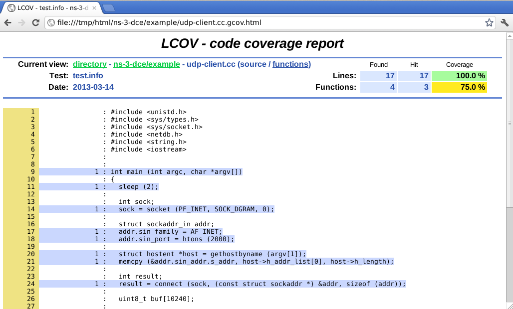

.. include:: replace.txt

Testing your protocols with DCE
===============================
Since DCE allows protocol implementations to expose network conditions (packet losses, reordering, and errors) with the interactions among distributed nodes, which is not easily available by traditional user-mode virtualization tools, exercising your code is easily done with a single simulation script.

Coverage Test
-------------
Improving code coverage with writing test programs is one of headache; 
- writing test program is annoying,
- preparing test network tends to be short-term, and
- the result is not reproducible.

This text describes how to measure code coverage of protocol implementations with DCE.

1. build target implementations (applications, kernel stack) with profile option
2. run test program with DCE
3. parse the result of test coverage

Setup
^^^^^
First, you need to compile your application with additional flags. **-fprofile-arcs -ftest-coverage** is used for a compilation flag (CFLAGS/CXXFLAGS), and **-fprofile-arcs** is used for a linker flag (LDFLAGS).

::

  gcc -fprofile-arcs -ftest-coverage -fPIC -c foo.c
  gcc -fprofile-arcs -pie -rdynamic foo.o -o newapp

Write Test Program
^^^^^^^^^^^^^^^^^^
Next, write a test program like |ns3| simulation script for your application (i.e., newapp).

::

  $ cat myscripts/dce-newapp.cc

  int main (int argc, char *argv[])
  {
    CommandLine cmd;
    cmd.Parse (argc, argv);
  
    NodeContainer nodes;
    nodes.Create (2);
  
    InternetStackHelper stack;
    stack.Install (nodes);
  
    DceManagerHelper dceManager;
    dceManager.Install (nodes);
  
    DceApplicationHelper dce;
    ApplicationContainer apps;
  
    // application on node 0
    dce.SetBinary ("newapp");
    dce.ResetArguments();
    apps = dce.Install (nodes.Get (0));
    apps.Start (Seconds (4.0));
  
    // application on node 1
    dce.SetBinary ("newapp");
    dce.ResetArguments();
    apps = dce.Install (nodes.Get (1));
    apps.Start (Seconds (4.5));
  
    Simulator::Stop (Seconds(100.0));
    Simulator::Run ();
    Simulator::Destroy ();
  
    return 0;
  }

Run Test
^^^^^^^^
Then, test your application as normal |ns3| (and DCE) simulation execution.

::

  ./waf --run dce-newapp

If you successfully finish your test, you will see the coverage data files (i.e., gcov data files) with a file extension *.gcda*.

::

  $ find ./ -name "*.gcda" 

  ./files-0/home/you/are/here/ns-3-dce/newapp.gcda
  ./files-1/home/you/are/here/ns-3-dce/newapp.gcda

Parse Test Result
^^^^^^^^^^^^^^^^^
We use `lcov <http://ltp.sourceforge.net/coverage/lcov.php>`_ utilities as a parse of coverage test result.

Put the compiler (gcc) generated files (\*.gcno) in the result directory,

::

   cp *.gcno ./files-0/home/you/are/here/ns-3-dce/
   cp *.gcno ./files-1/home/you/are/here/ns-3-dce/

then run the *lcov* and *genhtml* command to generate coverage information of your test program.

::

   lcov -c -d .-b . -o test.info
   genhtml test.info -o html

You will see the following output and generated html pages.
 
:: 

   Reading data file test.info
   Found 8 entries.
   Writing .css and .png files.
   Generating output.
   Processing file ns-3-dce/example/udp-server.cc
   genhtml: Use of uninitialized value in subtraction (-) at /usr/bin/genhtml line 4313.
   Processing file ns-3-dce/example/udp-client.cc
   genhtml: Use of uninitialized value in subtraction (-) at /usr/bin/genhtml line 4313.
   Processing file /usr/include/c++/4.4/iostream
   Processing file /usr/include/c++/4.4/ostream
   Processing file /usr/include/c++/4.4/bits/ios_base.h
   Processing file /usr/include/c++/4.4/bits/locale_facets.h
   Processing file /usr/include/c++/4.4/bits/char_traits.h
   Processing file /usr/include/c++/4.4/bits/basic_ios.h
   Writing directory view page.
   Overall coverage rate:
     lines......: 49.3% (35 of 71 lines)
     functions..: 31.6% (6 of 19 functions)

Fuzz Test
---------
(TBA, about integration of trinity)

Regression Test
---------------
(TBA)
